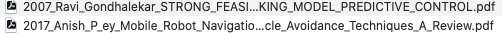

### Purpose

The purpose of this script is to automate the renaming process for paper PDFs.

### How to use this script?

Change the path `folder_path = "./"` in the script to the target folder.

### What constitute the new file name?

Year of the papar + Auther name(s) + Title of the paper

##### result:

1. Original

2. After rename:

   

